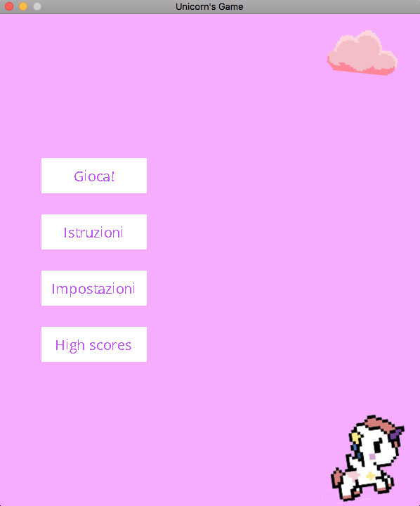
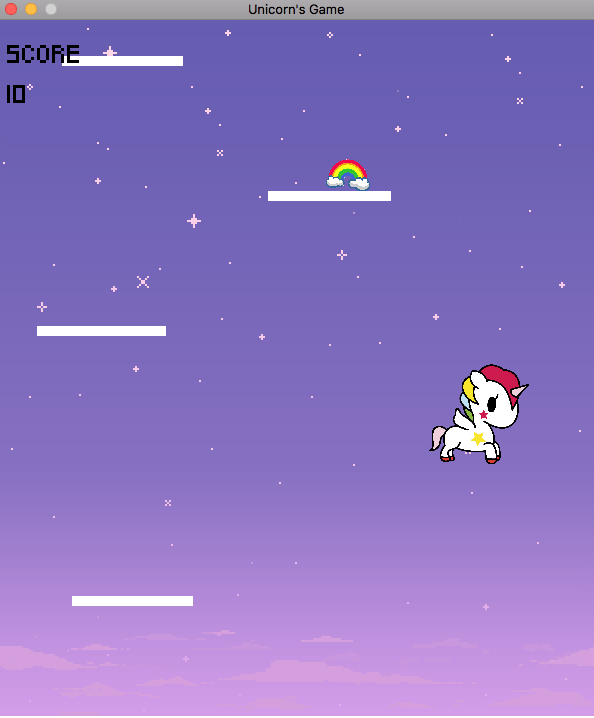

# Unicorns Game

A pink game for unicorn lovers! 

## How to install
### Step 1: 
Install SDL2 and vsgl2. The tutorial is [here](https://github.com/alessandro-bugatti/vsgl2/blob/master/README.md)

### Step 2: 
Install this game project - using either git or not.

If you have codeblocks, you can open .cpb file and run the game directly there - that's the only way I found when using Windows.
When using a UNIX sistem, you can either use Codeblocks or a little script that plays it.

```bash
cd /your/directories/Unicorns-Game
./run.sh
```

## How to play

This is the main page:



It will appear when you run the game. Here, you can:

- Play the game 
- Read the instructions
- Change some settings
- See the high scores (they are writed on a local file, sadly :c) 




Use left and right arrows to move the unicorn and make it jump on fake-clouds (they are rectangles, but that's not important). Use the 'S' key to fire the enemies.

You can change settings and use the mouse instead of arrows, but I **don't** advise it. 

There are various types of objects on blocks: some of them help you, some of them don't. You have to play a little bit to understand which of them are friendly and which aren't.

## How to contribute
There are several ways to contribute to this project:

- Play it! If you discover a bug, or if something unexpected happens, please tell me! 
- To insert your name for high scores, you have to write it in terminal - so obsolete! I'll fix it ASAP, in the meantime, if someone wants to do it... 😘
